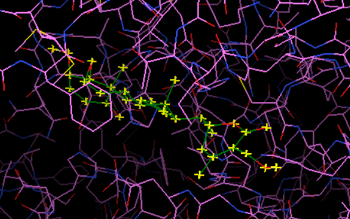

# In Silico Inhibition of NDM-1 Antibiotic Resistance Protein
**Project Status:** Completed 
**Tools Used:** AutoDock Vina, AutoDock Tools (ADT), PyMOL/Discovery Studio

## 🔬 Project Overview
Antibiotic resistance is a critical global health threat. The **New Delhi Metallo-beta-lactamase-1 (NDM-1)** enzyme confers bacterial resistance to carbapenems, a "last resort" antibiotic. 

This project utilizes **Structure-Based Drug Design (SBDD)** to screen **Withaferin A** (a natural bioactive compound) as a potential inhibitor against the NDM-1 active site.

## 📊 Key Findings
| Molecule | Binding Affinity (kcal/mol) | Significance |
|----------|-----------------------------|--------------|
| **Withaferin A** | **-8.6** | **High Potential** |
| Captopril (Control)| -6.0 | Standard Inhibitor |

> **Conclusion:** Withaferin A demonstrates a significantly stronger binding affinity (-8.6 kcal/mol) compared to the control, suggesting it may form a stable complex with the NDM-1 active site.

## 🛠️ Methodology & Troubleshooting
The project involved rigid-body docking simulations. Key technical challenges addressed:
* **Coordinate Optimization:** The PDB structure (3Q6X) required manual grid mapping. The search space was recalibrated to Center: `4.1, 19.1, 110.2` to target the Zinc co-factors accurately.
* **File Engineering:** Corrected PDBQT atom parsing errors and Gasteiger charge assignment for accurate electrostatics.

## 📸 Visualization
*The lowest energy pose of Withaferin A in the NDM-1 binding pocket.*



## 💻 Reproduction Command
To reproduce these results using AutoDock Vina:

```bash
vina.exe --receptor protein_RESET.pdbqt --ligand withaferin.pdbqt --center_x 4.1 --center_y 19.1 --center_z 110.2 --size_x 22 --size_y 22 --size_z 22 --out withaferin_final.pdbqt > withaferin_final_log.txt
